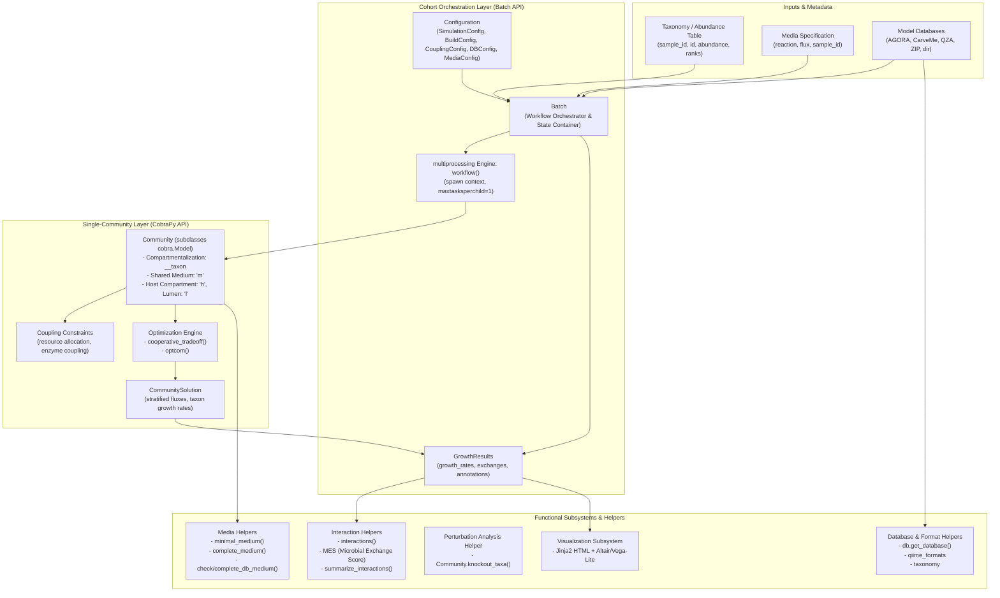
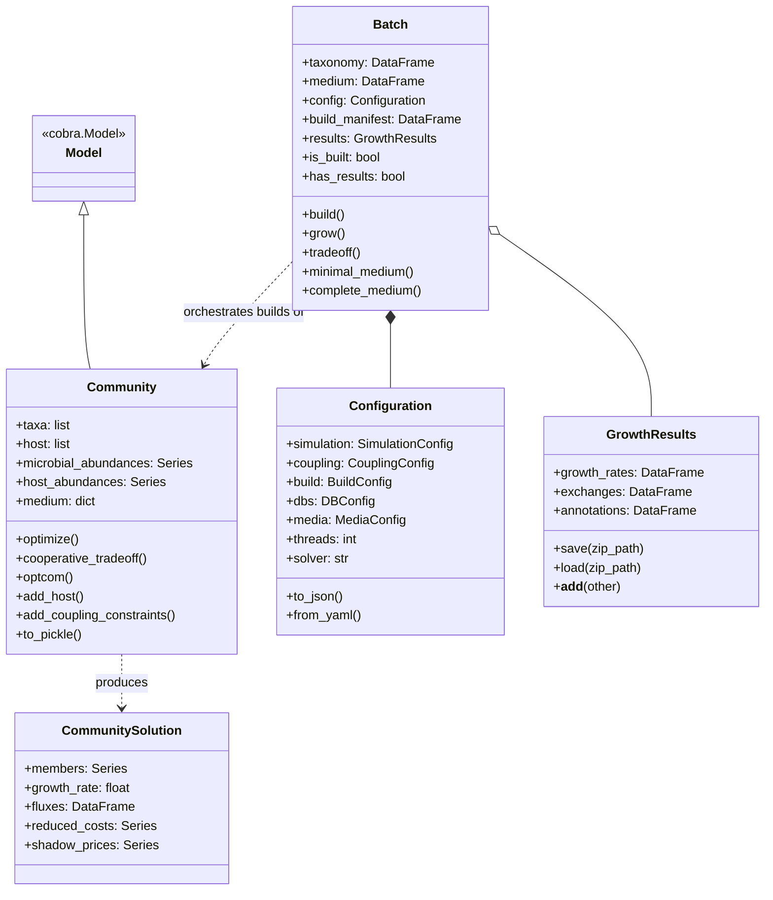
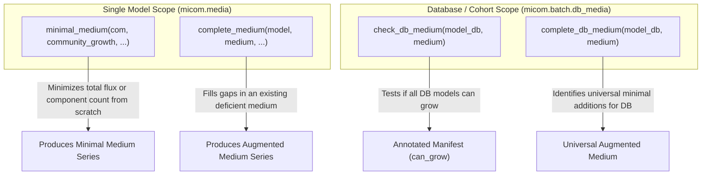
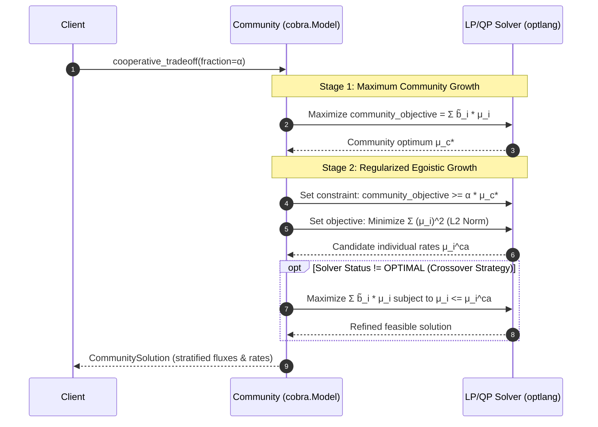
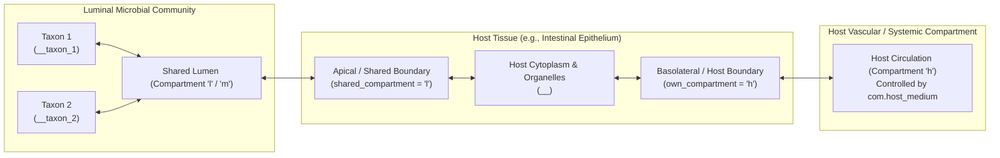
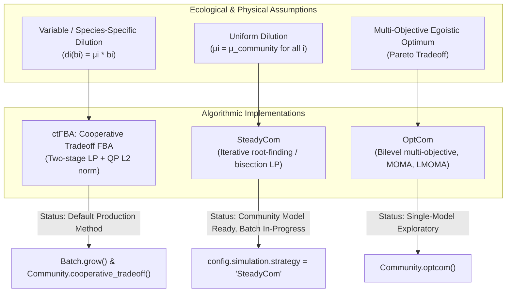

# MICOM Architecture and Design Document

## 1. Executive Summary & Architectural Overview

**MICOM** (**MI**crobial **CO**mmunity **M**odels) is a Python platform for genome-scale metabolic modeling of microbial communities, host-microbiome systems, and microbial ecosystems. It integrates microbial relative abundances (from 16S amplicon or shotgun metagenomic sequencing) with constraint-based reconstruction and flux balance analysis (COBRA / FBA).

### Core Problem & Biological Rationale

Classic single-organism FBA assumes an isolated steady state where biomass production is maximized. When modeling multi-species communities, this assumption breaks down:
1. **Unconstrained Competition**: Maximizing total community biomass without cooperativity yields "winner-take-all" dynamics where the single fastest-growing taxon consumes all available nutrients, predicting zero growth for the majority of observed community members.
2. **Dilution in Open Ecosystems**: In natural systems (e.g., the mammalian gut or continuous-flow bioreactors), bacteria are washed out or removed by dilution. Under steady state, microbial abundance can remain constant only when taxon growth rates $\mu_i$ balance taxon-specific dilution rates $d_i(b_i)$:
  $$\frac{d b_i(t)}{dt} = \mu_i b_i(t) - d_i(b_i) = 0$$
   Because relative abundances $\tilde{b}_i = b_i / B$ are preserved under steady-state dilution, an infinite family of individual growth rates is mathematically consistent with observed community composition.
3. **Cooperative Tradeoff Principle**: MICOM resolves this indeterminacy by enforcing a two-stage multi-objective optimization: maintain a biologically realistic fraction $\alpha \in [0, 1]$ of the maximal community growth rate, while minimizing the dispersion of individual growth rates (via L2-norm regularization) so that all taxa can coexist and grow simultaneously.

### High-Level Architecture Diagram



---

## 2. Separation Between the Batch API and the Basic CobraPy API

A central architectural decision in MICOM is the strict separation between the **Single Model (CobraPy) API** and the **Batch API**.


### 2.1 Design Motivations for the Separation

1. **Memory Isolation & Solver Leak Mitigation**:
   COBRApy and its underlying mathematical programming abstraction layer (`optlang`) rely on native C/C++ solver bindings (CPLEX, Gurobi, GLPK, HiGHS). When solving large quadratic and linear programming problems across hundreds of communities sequentially in a single Python process, native memory leaks and non-reclaimed solver environments accumulate rapidly. The Batch API solves this by delegating execution to [`workflow`](micom/batch/core.py#L14-L67), which spawns worker processes using `multiprocessing.get_context("spawn").Pool(processes=threads, maxtasksperchild=1)`. Every sample is optimized in a clean process space that terminates immediately upon task completion, guaranteeing complete memory reclamation.
2. **Tabular Cohort Data vs. Object-Oriented Mathematical Entities**:
   Microbiome studies typically present cohorts of dozens to thousands of samples, summarized as abundance tables (e.g. from QIIME 2, BIOM, or CSV) and clinical metadata. The Single Model API operates at the level of reactions, metabolites, and constraint expressions, requiring users to manually manage bounds and indices. The Batch API abstracts this complexity into a tabular contract: input is a tidy DataFrame; output is a tidy DataFrame.
3. **Decoupling Heavy Computations (Build vs. Grow vs. Tradeoff)**:
   Community model construction is disk- and CPU-intensive because it involves merging multiple SBML models, checking compartments, and adjusting stoichiometry. The Batch API persists built models as serialized `.pickle` files and tracks them through a central `manifest.csv`. Subsequent growth simulations, media adjustments, or tradeoff scans can run repeatedly without rebuilding the underlying models.

### 2.2 Detailed Comparison

| Dimension | Single Model (CobraPy) API | Batch API |
| :--- | :--- | :--- |
| **Primary Entrypoint** | [`Community`](micom/community.py#L38-L1272) in `micom.community` | [`Batch`](micom/batch/batch.py#L26-L723) in `micom.batch` |
| **Inheritance Base** | Subclasses `cobra.Model` | Independent class (composition over inheritance) |
| **Target Scope** | A single community (one sample/individual) | An arbitrary cohort of samples |
| **Configuration Style** | Method arguments, direct property setters, context managers | Structured Pydantic [`Configuration`](micom/batch/configuration.py#L83-L215) object |
| **Parallelization** | Single-threaded in-process execution | Multi-process worker pool via [`core.workflow`](micom/batch/core.py#L14-L67) |
| **Model Persistence** | Manual `com.to_pickle("path.pickle")` | Automated folder storage + `manifest.csv` |
| **Solution Object** | [`CommunitySolution`](micom/solution.py#L39-L116) (subclasses `cobra.core.Solution`) | [`GrowthResults`](micom/batch/results.py#L20-L116) (named dataclass of 3 DataFrames) |
| **QIIME 2 Interoperability** | Low-level format loaders in `qiime_formats.py` | Direct `.qza` consumption for media and databases |

### 2.3 Interoperability & Data Flow Between APIs

The Batch API does not re-implement community modeling; it wraps and automates the Single Model API:
1. **Model Construction**: [`Batch.build()`](micom/batch/batch.py#L145-L246) dispatches [`build_and_save`](micom/batch/build.py#L26-L48) to workers. Each worker instantiates a [`Community`](micom/community.py#L38-L1272) instance from taxonomic rows and reference models, calls `com.to_pickle(out_path)`, and returns construction metrics.
2. **Growth Simulation**: [`Batch.grow()`](micom/batch/batch.py#L247-L335) dispatches [`_growth`](micom/batch/grow.py#L25-L104). The worker deserializes the pickled `Community` with [`load_pickle`](micom/util.py#L425-L436), applies boundary media and coupling constraints, executes `com.cooperative_tradeoff()`, and collects primal fluxes.
3. **Solution Conversion**: If single-model analyses need to be ingested into batch workflows, [`GrowthResults.from_solution(sol, com)`](micom/batch/results.py#L85-L116) melts the multi-compartment `CommunitySolution` into tidy format matching `Batch.grow()`.

---

## 3. Core Domain Entities vs. Helpers and Subsystems

The codebase is organized into **Core Domain Entities** (which represent the community models, cohort state, configuration, and solutions) and **Helper Subsystems** (which perform media completion, ecological scoring, visualization, database manipulation, and numerical routines).



---

### 3.1 Core Entities

#### A. `Community` ([`micom.community.Community`](micom/community.py#L38-L1272))
Subclasses `cobra.Model` to represent a single multi-species (or host-microbiome) ecosystem:
- **ID & Compartment Renaming**: Each taxon's internal metabolites and reactions receive a unique suffix `__<taxon_id>` (e.g., `atp_c__Escherichia_coli`).
- **Shared Medium Compartment (`m`)**: A shared external environment compartment where external metabolite exchange occurs. Taxon exchange reactions are coupled to the medium through abundance weighting:
  $$\text{Taxon export/import: } M_{e\_i} \rightleftharpoons \tilde{b}_i \cdot M_m$$
  This ensures that imports and exports are scaled by the taxon's relative biomass fraction $\tilde{b}_i$.
- **Host Integration (`h` and `l`)**: Via [`Community.add_host()`](micom/community.py#L1060-L1119), host tissues can be integrated with dual compartments: a shared luminal compartment `l` (shared with gut microbes) and a vascular/host compartment `h` with its own `host_medium`.
- **Primary Optimization Methods**:
  - `optimize()`: Standard community FBA returning a [`CommunitySolution`](micom/solution.py#L39-L116).
  - `cooperative_tradeoff()`: Two-stage regularized optimization balancing community and individual growth rates.
  - `optcom()`: Classic bilevel multi-objective algorithms (MOMA, LMOMA, original bilevel OptCom).
  - `add_coupling_constraints()`: Enforces enzymatic flux constraints proportional to growth rate.

`knockout_taxa()` is a single-community perturbation-analysis helper that applies cooperative tradeoff to sequential taxon knockouts; it is not a separate simulation method.

#### B. `Batch` ([`micom.batch.batch.Batch`](micom/batch/batch.py#L26-L723))
High-level cohort orchestrator:
- **Contract & Validation**: Validates taxonomy and media tables at initialization using [`check_taxonomy`](micom/types.py#L103-L157) and [`check_medium`](micom/types.py#L65-L100).
- **State Machine Properties**: Exposes `is_built`, `has_results`, and `has_tradeoffs` flags to guarantee proper stage execution before simulations.
- **Workflow Endpoints**:
  - `build(out_folder)`: Assembles, validates, and serializes sample models in parallel; returns `manifest.csv`.
  - `grow()`: Simulates steady-state community growth across all samples using cooperative tradeoff and minimal imports / pFBA; returns [`GrowthResults`](micom/batch/results.py#L20-L116).
  - `tradeoff(tradeoffs)`: Evaluates a grid of tradeoff coefficients $\alpha \in [0.1, 1.0]$ across all samples to determine community viability curves.
  - `minimal_medium()` / `complete_medium()`: Computes or augments media across all cohort samples.
- **Knockout analysis**: There is no Batch API equivalent to `Community.knockout_taxa()` yet; a cohort-level helper may be useful in the future.
- **Rich Display Formatting**: Implements `__str__` and `_repr_html_` providing concise terminal and Jupyter notebook dashboards with sample/taxa counts, database status, and mean growth rates.

#### C. `Configuration` ([`micom.batch.configuration.Configuration`](micom/batch/configuration.py#L83-L215))
A strongly-typed, declarative configuration hierarchy based on Pydantic v2:
- Sub-configurations:
  - `SimulationConfig`: Strategy (`ctFBA`, `SteadyCom`), `tradeoff` parameter, `flux_method` (`minimal imports`, `pFBA`, `none`), and host parameters.
  - `CouplingConfig`: Enzyme coupling strategy (`resource constraint`, `resource coupling`, `enzyme coupling`), constraint limits, and tolerances.
  - `BuildConfig`: Abundance filtering `cutoff` and `force_rebuild` flag.
  - `DBConfig`: Model database path/URL (supporting `default://` Zenodo links), host database, and download cache directory.
  - `MediaConfig`: Flux weightings and `max_import` bounds.
- Serialization: Full round-trip persistence via `to_json()`, `from_json()`, `to_yaml()`, `from_yaml()`.

#### D. `GrowthResults` ([`micom.batch.results.GrowthResults`](micom/batch/results.py#L20-L116))
Standardized data container holding the triad of cohort simulation outputs:
- `growth_rates`: DataFrame containing `sample_id`, `taxon`, `abundance`, and predicted `growth_rate`.
- `exchanges`: Long/tidy DataFrame containing `sample_id`, `taxon`, `reaction`, `metabolite`, `direction` (import/export), and `flux` (mmol/gDW/h).
- `annotations`: Metabolite annotations extracted from boundary exchanges.
- Features: Single `.zip` archive I/O (`save()`, `load()`) and additive composition (`results_a + results_b`) to merge cohorts.

#### E. `CommunitySolution` ([`micom.solution.CommunitySolution`](micom/solution.py#L39-L116))
Extends `cobra.core.Solution` to capture the multi-compartment nature of communities:
- `members`: Summary Series/DataFrame of taxon IDs, abundances, and individual growth rates $\mu_i$.
- `growth_rate`: Total community biomass production rate $\tilde{\mu}_c$.
- `fluxes`: 2D DataFrame where rows represent taxa (and medium), and columns represent global reaction IDs.

---

### 3.2 Helper & Utility Subsystems

#### A. Growth Media Helpers ([`micom.media`](micom/media.py) & [`micom.batch.db_media`](micom/batch/db_media.py))
Metabolic models cannot produce biomass without adequate input nutrients. MICOM provides four complementary helpers:



1. [`minimal_medium`](micom/media.py#L135-L263):
   Calculates the smallest set of import fluxes required to sustain target community and individual growth rates.
   - **Formulation**: Minimizes $\sum_i w_i |v_i|$ (Linear LP) or $\sum_i \mathbb{I}(v_i > 0)$ using binary indicator variables (Mixed-Integer MIP).
   - **Weighting**: Supports uniform, molecular mass, or elemental weights (e.g. minimizing total carbon flux).
2. [`complete_medium`](micom/media.py#L265-L402):
   Takes an existing (often incomplete or defined) growth medium and determines the minimal additional import fluxes required for biomass formation, keeping original imports fixed or bounded.
3. [`check_db_medium`](micom/batch/db_media.py#L79-L138):
   Audits a reference model database (e.g., AGORA2) against a specific diet/medium in parallel, generating an annotated manifest reporting whether each organism can grow (`can_grow = True/False`).
4. [`complete_db_medium`](micom/batch/db_media.py#L141-L295):
   Iteratively discovers the minimal set of nutrient supplements required to ensure that *every* organism in a reference database can grow on a defined diet.

#### B. Parallel Multiprocessing Engine ([`micom.batch.core`](micom/batch/core.py))
- [`workflow(func, args, threads, description, progress)`](micom/batch/core.py#L14-L67):
  The computational backbone for all batch processing.
  - Implements `multiprocessing.get_context("spawn").Pool(processes=threads, maxtasksperchild=1)`.
  - Integrates directly with [`rich.progress.track`](micom/logger.py) for terminal progress bars.
  - Automatically falls back to clean single-threaded generator mapping when `threads=1` to avoid IPC overhead.

#### C. Ecological Interactions & Scoring ([`micom.interaction`](micom/interaction))
Transforms raw exchange fluxes from [`GrowthResults`](micom/batch/results.py#L20-L116) into quantifiable ecological interaction networks:
- [`sample_interactions`](micom/interaction/focal.py#L11-L72) & [`interactions`](micom/interaction/focal.py#L75-L141):
  Classifies exchange flux pairs between a focal taxon and partner taxa for each metabolite:
  - **Co-consumed**: Both taxa import the metabolite (resource competition).
  - **Provided**: Focal taxon exports the metabolite, partner imports it (cross-feeding/commensalism).
  - **Received**: Partner exports the metabolite, focal taxon imports it.
- [`MES`](micom/interaction/scores.py#L63-L101) (**M**icrobial **E**xchange **S**core):
  Quantifies the mutual metabolic exchange potential for a given metabolite across producer count $p$ and consumer count $c$:
  $$\text{MES} = \frac{2 \cdot p \cdot c}{p + c}$$
- [`basic`](micom/interaction/scores.py#L15-L60): Computes abundance-weighted consumption and production fluxes alongside producer/consumer counts per metabolite.
- [`summarize_interactions`](micom/interaction/summary.py#L14-L67): Aggregates granular interaction fluxes into total exchange classes, mass flux (gDW), carbon flux, and nitrogen flux.

#### D. Interactive Visualization Subsystem ([`micom.viz`](micom/viz))
Builds standalone, portable HTML dashboards embedding Vega-Lite / Altair charts and data tables:
- [`Visualization`](micom/viz/core.py#L16-L53): Base class rendering Jinja2 templates located in `micom/data/templates`. Includes `.view()` to open directly in the browser and `.save(out_path)` to dump HTML.
- Visualization Modules:
  - [`plot_growth`](micom/viz/growth.py): Taxon- and sample-level growth rate distributions.
  - [`plot_tradeoff`](micom/viz/tradeoff.py): Community tradeoff curves (growing taxa fraction vs. $\alpha$).
  - [`plot_exchanges_per_sample`](micom/viz/exchanges.py#L13-L75) & [`plot_exchanges_per_taxon`](micom/viz/exchanges.py#L78-L135): Import/export flux heatmaps and consumption patterns.
  - [`plot_focal_interactions`](micom/viz/interactions.py#L12-L73) & [`plot_mes`](micom/viz/interactions.py#L76-L137): Interactive interaction networks and MES rankings.
  - [`plot_association`](micom/viz/association.py): Statistical associations between fluxes/growth rates and clinical phenotypes.

#### E. Database, Taxonomy & External Format Helpers
- [`micom.db`](micom/db.py): Resolves local paths or remote URLs, including the `default://` scheme which maps to curated Zenodo repositories (e.g. AGORA, CarveMe) with streaming progress downloads.
- [`micom.batch.build.build_database`](micom/batch/build.py#L75-L192): Builds summarized genus- or species-level reference databases from individual SBML models by merging pan-metabolic networks.
- [`micom.taxonomy`](micom/taxonomy.py): Harmonizes taxonomy rank prefixes (e.g. standardizing `g__Bacteroides` and `Bacteroides`).
- [`micom.qiime_formats`](micom/qiime_formats.py): Parses and writes QIIME 2 `.qza` archives for seamless microbiome pipeline integration.
- [`micom.elasticity`](micom/elasticity.py): Computes sensitivity coefficients $\frac{\partial \ln v_j}{\partial \ln \theta_k}$ (elasticities) of fluxes and growth rates in response to nutrient bound shifts or taxon abundance alterations.

---

## 4. Mathematical Modeling & Optimization Architecture



### 4.1 Community Mass Conservation & Stoichiometry

Let $M_j^i$ denote metabolite $j$ in the internal compartment of taxon $i$, and $M_j^m$ denote metabolite $j$ in the shared medium compartment $m$.

1. **Internal Taxon Reactions**:
   For each taxon $i$, internal stoichiometry matches its organism-specific reconstruction:
   $$S^i v^i = 0$$
2. **Internal Exchange Reactions**:
   Transport between taxon $i$ and shared medium $m$ is scaled by relative abundance $\tilde{b}_i = b_i / B$:
   $$M_j^i \xrightarrow{e_j^i} \tilde{b}_i M_j^m$$
3. **External Medium Exchanges**:
   Exchange reactions between medium $m$ and the outside environment have boundary rates $v_j^m$:
   $$\emptyset \xrightarrow{E_j^m} M_j^m$$
   Under quasi-steady state for medium metabolites:
   $$\frac{d M_j^m}{dt} = v_j^m - \sum_{i} \tilde{b}_i e_j^i = 0 \implies v_j^m = \sum_{i} \tilde{b}_i e_j^i$$
   The net import or export of metabolite $j$ by the community directly equals the abundance-weighted sum of individual taxon exchange rates.

### 4.2 Cooperative Tradeoff Formulation

1. **Step 1: Classical Community FBA**:
   $$\mu_c^* = \max_{v} \sum_{i} \tilde{b}_i \mu_i \quad \text{s.t.} \quad S v = 0, \quad v_{lb} \leq v \leq v_{ub}$$
2. **Step 2: Quadratic Regularization (L2-Norm Minimization)**:
   $$\min_{v} \sum_{i} (\mu_i)^2$$
   $$\text{subject to} \quad \sum_{i} \tilde{b}_i \mu_i \geq \alpha \cdot \mu_c^*, \quad S v = 0, \quad v_{lb} \leq v \leq v_{ub}$$
   where $\alpha \in [0, 1]$ is the tradeoff parameter. Minimizing the sum of squared individual growth rates spreads flux evenly across all taxa, preventing single-taxon dominance while honoring the community growth floor.

### 4.3 Interior-Point Crossover Strategy

For large community models (50,000 to 500,000+ variables), barrier/interior-point algorithms in QP solvers can encounter numerical tolerances or stall near the optimum. When the solver status is non-optimal, [`crossover`](micom/solution.py#L226-L255) fixes the candidate growth rates $\mu_i^{ca}$ from the interior-point iterate as upper bounds and solves a secondary linear program:
$$\max_{v} \sum_{i} \tilde{b}_i \mu_i \quad \text{s.t.} \quad \mu_i \leq \mu_i^{ca}, \quad S v = 0, \quad v_{lb} \leq v \leq v_{ub}$$
This projects the quadratic solution back onto the feasible polytope, obtaining clean basic feasible solutions.

### 4.4 Enzyme Resource Allocation and Flux Coupling

In unconstrained FBA, flux magnitude is unbounded if pathways are balanced. In living cells, total catalytic capacity is limited by protein crowding. MICOM supports three coupling modes via [`add_coupling_constraints`](micom/community.py#L1169-L1272):
- **Resource Allocation Constraint**:
  $$\sum_{j} |v_j^i| \leq C$$
- **Resource Coupling**:
  $$\sum_{j} |v_j^i| \leq C \cdot \mu_i$$
- **Enzyme Coupling**:
  $$|v_j^i| \leq C \cdot \mu_i + \text{lower}$$

---

## 5. Host Modeling & Multi-Tissue Integration

MICOM supports modeling interactions between microbial communities and host tissues (e.g., intestinal epithelial cells, hepatocytes, immune cells). This enables investigating how diet, microbial fermentations, and host metabolism mutually influence systemic phenotypes.



### 5.1 Anatomical Topology & Compartments

A fundamental physiological reality of mucosal interfaces is **spatial polarization**:
- **Shared Luminal Compartment (`l` or `m`)**: The apical interface. Microbes and host cells both import from and export into this compartment. Microbial waste products (e.g., short-chain fatty acids like acetate, propionate, butyrate) and dietary metabolites reside here.
- **Vascular / Host Compartment (`h`)**: The basolateral interface. Represents systemic blood circulation (portal vein, systemic plasma). Host tissue can export metabolites to or absorb nutrients from circulation without exposing them directly to the lumen.

In [`Community.add_host()`](micom/community.py#L1060-L1119):
- Reactions and metabolites inside the host model receive the suffix `__<host_id>`.
- Internal exchange reactions connecting host cytoplasm to the shared lumen (`shared_compartment="l"`) are scaled by the host's abundance $b_{\text{host}}$:
  $$M_j^{\text{host}} \rightleftharpoons b_{\text{host}} \cdot M_j^l$$
- Host-side boundary exchange reactions connecting host cytoplasm to the blood circulation (`own_compartment="h"`) are created and managed separately:
  $$M_j^{\text{host}} \rightleftharpoons \frac{b_{\text{host}}}{\sum b_{\text{host}}} \cdot M_j^h$$
  Boundary flux limits for these reactions are governed by [`Community.host_medium`](micom/community.py#L1121-L1168).

### 5.2 Abundance Normalization & Units

- **Microbial Biomass Base**: Microbial relative abundances are normalized such that the total microbial community biomass equals $1\text{ gDW}$ ($\sum_{i \in \text{taxa}} \tilde{b}_i = 1.0$).
- **Relative Host Abundance**: Host abundance $b_{\text{host}}$ is defined **relative to $1\text{ gDW}$ of microbial biomass**. For instance, if a mucosal biopsy or physiological model estimates $50\text{ gDW}$ of enterocytes per $1\text{ gDW}$ of luminal bacteria, $b_{\text{host}} = 50.0$.
- **Dynamic Updates**: Modifying [`com.microbial_abundances`](micom/community.py#L640-L688) or [`com.host_abundances`](micom/community.py#L690-L740) automatically triggers stoichiometry rescanning and constraint re-computation via `__update_exchanges()`.

### 5.3 Simulation Paradigms for Host Models

The Batch API configuration [`SimulationConfig`](micom/batch/configuration.py#L20-L35) provides two distinct paradigms for simulating host-microbe systems:

1. **Sequential Hierarchy (`host_method = "before"`)**:
   - Host maintenance and energy requirements take precedence over microbial proliferation.
   - The host objective (e.g. ATP maintenance or tissue turnover) is solved first via [`com.optimize_host()`](micom/community.py#L594-L638) to determine its maximum feasible rate $\mu_{\text{host}}^*$.
   - The host growth rate is then constrained:
     $$\mu_{\text{host}} \geq \text{host\_growth} \cdot \mu_{\text{host}}^* \quad (\text{if host\_relative = True})$$
   - Finally, microbial community growth is simulated using standard `cooperative_tradeoff()`.
2. **Joint Cooperative Tradeoff (`host_method = "ctFBA"`)**:
   - Host tissue is treated as an active participant in the community's cooperative objective.
   - The L2-norm regularization objective includes the host tissue variables:
     $$\min_{v} \left[ \sum_{i \in \text{taxa}} \mu_i^2 + \sum_{k \in \text{host}} \mu_k^2 \right]$$
     $$\text{subject to} \quad \mu_c \geq \alpha \cdot \mu_c^*$$
   - This models mutual metabolic cooperation and resource sharing between host and microbiota under nutritional pressure.

---

## 6. Alternative Community Algorithms & Future Roadmap

MICOM supports multiple community modeling algorithms, each embodying distinct biological assumptions.



### 6.1 Methodological Comparison

| Method | Mathematical Principle | Biological Dilution Assumption | Complexity & Scalability | Status in MICOM |
| :--- | :--- | :--- | :--- | :--- |
| **Cooperative Tradeoff (ctFBA)** | Two-stage LP + regularized QP: $\min \sum \mu_i^2$ s.t. $\mu_c \geq \alpha \mu_c^*$ | Taxon-specific dilution balancing growth: $d_i = \mu_i b_i$ | $O(1)$ LP + $O(1)$ QP. Scales to 100+ taxa and thousands of samples. | **Default Production Strategy** in both Single Model and Batch APIs. |
| **SteadyCom** (Chan et al., 2017) | Constrains all taxa to an identical growth rate: $\mu_i = \mu_{\infty}$ for all $i$ | Uniform dilution across all taxa | Requires bisection / root-finding search over $\mu_{\infty}$. | Available in Single Model API; Batch API support is on the active refactor roadmap. |
| **OptCom: Original** (Zomorrodi et al., 2012) | Bilevel multi-objective optimization (Pareto frontier) | Maximizes community growth and individual growth simultaneously | Non-convex bilevel problem. Very slow; limited to toy communities (2–5 taxa). | Available via [`Community.optcom(strategy="original")`](micom/community.py#L862-L916). |
| **OptCom: MOMA / LMOMA** | Quadratic/Linear distance minimization between egoistic optima and community flux | Intermediate cooperativity cost penalty | Doubles number of decision variables; slower than ctFBA. | Available via [`Community.optcom()`](micom/community.py#L862-L916) with either `strategy="moma"` or `strategy="lmoma"`. |

### 6.2 Biological Distinction: Species-Specific vs Uniform Dilution

- **In ctFBA (Diener et al., 2020)**: In open, heterogeneous habitats like the mammalian colon, bacteria exhibit spatial niche partitioning (mucus layer adherence, crypt occupancy, luminal flow). Adherent taxa (e.g. *Akkermansia muciniphila*) wash out much slower than fast-flowing luminal taxa. Thus, dilution is species-specific ($d_i(b_i)$), and taxa maintain different steady-state growth rates $\mu_i$.
- **In SteadyCom (Chan et al., 2017)**: Assumes a well-mixed chemostat with uniform washout: all species must divide at the exact same rate $\mu_{\infty}$. If one taxon's nutrient capacity caps its growth rate below $\mu_{\infty}$, it is eventually washed out.

### 6.3 Batch API Roadmap for Alternative Algorithms

1. **SteadyCom Integration in Batch API**:
   - `Batch.grow()` currently raises `NotImplementedError` when `config.simulation.strategy == "SteadyCom"`.
   - The roadmap involves incorporating a bounded bisection root-finder in [`micom/batch/grow.py`](micom/batch/grow.py) that iteratively evaluates feasible community growth rates $\mu_{\infty}$ with solver tolerance checks.
2. **HiGHS Solver Integration & Tuning**:
   - The modern open-source HiGHS solver provides fast LP and QP capabilities, reducing reliance on proprietary commercial licenses (CPLEX/Gurobi) for interior-point crossover.
3. **Automated Host Batch Pipelines**:
   - End-to-end integration of host tissue models into `Batch.build()` and `Batch.grow()` via `config.dbs.host` and `config.simulation.host_method`.

---

## 7. File Formats, Contracts, and Data Flow

### 7.1 Input Contracts
- **Taxonomy Table**: A `pandas.DataFrame` or CSV file containing:
  - `sample_id`: Sample identifier.
  - `id`: Taxon identifier (formatted to valid alphanumeric/underscore IDs).
  - `abundance`: Relative or absolute abundance (normalized to 1.0 per sample during initialization).
  - Taxonomic rank columns (`kingdom`, `phylum`, `class`, `order`, `family`, `genus`, `species`, `strain`).
  - Optional `file` column when custom model paths are used without a model database.
  - Optional `is_host` boolean column identifying host tissue models.
- **Medium Specification**: A `pandas.DataFrame` or CSV file containing:
  - `reaction`: Reaction ID in the shared environment (e.g., `EX_glc__D_m`).
  - `flux`: Maximum allowed import flux (positive float, mmol/gDW/h).
  - Optional `sample_id` column for sample-specific diets (if absent, the medium is applied universally).

### 7.2 Storage Artifacts
- **Community Models**: Pickled `Community` objects (`<sample_id>.pickle`) stored in `out_folder`.
- **Manifest (`manifest.csv`)**: Generated by `Batch.build()`, tracking file names, sample metadata, and database matching metrics:
  - `found_taxa`: Number of taxa matched in the reference database.
  - `total_taxa`: Total taxa present in the input taxonomy.
  - `found_fraction`: Taxon coverage ($N_{found} / N_{total}$).
  - `found_abundance_fraction`: Abundance coverage ($\sum b_{found} / \sum b_{total}$).
- **Growth Results (`results.zip`)**: A ZIP archive containing `growth_rates.csv`, `exchanges.csv`, and `annotations.csv`.

---

## 8. Directory Structure & Module Map

```text
micom/
├── __init__.py               # Top-level exports (Batch, Configuration, Community, show_versions)
├── community.py              # Core: Community class extending cobra.Model
├── problems.py               # Mathematical problem formulations (cooperative_tradeoff, L2 norm)
├── solution.py               # Solution wrappers (CommunitySolution, crossover, solver retry)
├── optcom.py                 # Classic OptCom multi-level formulations (MOMA, LMOMA, bilevel)
├── media.py                  # Single-model media helpers (minimal_medium, complete_medium)
├── coupling.py               # Enzyme resource allocation & flux coupling constraints
├── elasticity.py             # Sensitivity & elasticity coefficient derivations
├── measures.py               # Ecological niche metrics
├── stats.py                  # Statistical association testing for clinical variables
├── db.py                     # Database download & manifest loading utilities
├── taxonomy.py               # Taxonomy rank unification and formatting
├── types.py                  # Type validation decorators (@pathify, check_taxonomy, check_medium)
├── constants.py              # Constants (taxonomic RANKS, flux DIRECTION, download URLs)
├── logger.py                 # Rich console and logging configuration
├── qiime_formats.py          # QIIME 2 artifact (.qza) readers and writers
├── batch/                    # Cohort Batch API subsystem
│   ├── __init__.py           # Batch exports (Batch, Configuration, GrowthResults, workflow)
│   ├── batch.py              # Core: Batch class orchestrating cohorts
│   ├── configuration.py      # Core: Pydantic Configuration schemas
│   ├── core.py               # Multiprocessing engine: workflow()
│   ├── build.py              # Parallel model building & database generator (build_database)
│   ├── grow.py               # Parallel growth simulation worker (_growth)
│   ├── tradeoff.py           # Parallel tradeoff scan worker (_tradeoff)
│   ├── media.py              # Batch media helpers (process_medium, _fix_medium, _medium)
│   ├── db_media.py           # Database-wide media checkers (check_db_medium, complete_db_medium)
│   └── results.py            # Core: GrowthResults dataclass and serialization
├── interaction/              # Ecological interaction scoring subsystem
│   ├── __init__.py           # Exports (interactions, MES, basic, summarize_interactions)
│   ├── focal.py              # Taxon-focal interaction classification (co-consumed, provided, received)
│   ├── scores.py             # Exchange metrics and MES (Microbial Exchange Score)
│   └── summary.py            # Summary aggregation by interaction class, mass, C, and N
└── viz/                      # Interactive HTML / Vega-Lite visualization subsystem
    ├── __init__.py           # Exports (plot_growth, plot_tradeoff, plot_exchanges, plot_interactions)
    ├── core.py               # Base Visualization class wrapping Jinja2 templates
    ├── growth.py             # Growth rate distributions
    ├── tradeoff.py           # Tradeoff curves
    ├── exchanges.py          # Exchange heatmaps per sample and taxon
    ├── interactions.py       # Interaction networks & MES plots
    └── association.py        # Clinical phenotype association plots
```
